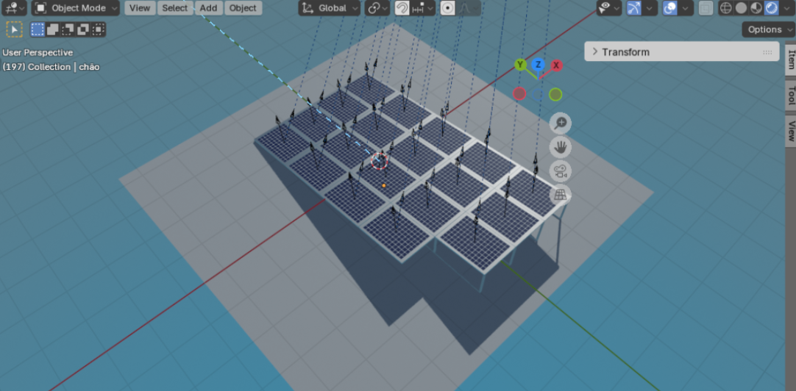

# ☀️ Simulação de Sistema Fotovoltaico com Blender

Simulação computacional de um sistema fotovoltaico utilizando modelagem 3D e análise de dados para estudar o comportamento da radiação solar e a potência elétrica gerada ao longo do dia.

O projeto combina simulação no Blender com análise numérica em Python para comparação com dados reais de irradiação solar.

---

# 🖼️ Simulação do Sistema



---

# 🎯 Objetivo

Realizar uma simulação computacional de um sistema fotovoltaico o mais próximo possível da realidade, permitindo:

- análise da posição solar
- cálculo do ângulo de incidência
- estimativa da potência elétrica gerada
- comparação com dados reais de sensores

---

# 🧰 Tecnologias Utilizadas

- Blender
- Python
- Pandas
- Matplotlib

---

# ⚙️ Metodologia

O projeto foi desenvolvido a partir de três pilares principais:

## 1️⃣ Modelo Digital

O sistema fotovoltaico foi modelado no Blender utilizando módulos com as seguintes características:

**Fabricante:** Jinko Solar  
**Modelo:** JKM270PP-60  

**Dimensões**

- 1650 mm × 992 mm × 40 mm

**Eficiência**

- 16,5%

Apesar do sistema possuir 19 módulos instalados, a simulação considerou apenas um painel com inclinação de **6°**.

---

## 2️⃣ Posição do Sol

Foi utilizado o add-on **Sun Position**, que calcula a posição solar a partir de:

- latitude
- longitude
- dia do ano

Esse complemento utiliza o modelo da calculadora solar do **NOAA Global Monitoring Laboratory**.

A simulação foi configurada com:

- **1 frame = 1 minuto**
- **Frame inicial:** nascer do sol  
- **Frame final:** pôr do sol

---

## 3️⃣ Ângulo de Incidência

O cálculo do ângulo de incidência foi realizado através do **produto escalar** entre:

- vetor normal ao painel
- vetor direção do sol

Equação utilizada:

```
cos(θ) = n · s
```

A implementação foi feita utilizando **scripts em Python**.

---

# ⚡ Cálculo da Potência

A potência elétrica foi estimada utilizando:

```
P = G * A * η * cos(θ)
```

Onde:

- **G** → Irradiação solar  
- **A** → Área do painel  
- **η** → Eficiência do módulo  
- **θ** → Ângulo de incidência  

---

# 📊 Análise dos Resultados

A análise dos dados foi realizada utilizando Python com as bibliotecas:

- Pandas → organização dos dados
- Matplotlib → visualização gráfica

Os dados utilizados incluem:

- resultados da simulação
- dados experimentais coletados por sensores instalados no sistema fotovoltaico

Exemplo de resultado:


---

# 🔬 Validação da Simulação

Os resultados foram comparados com:

- SunEarthTools (calculadora solar online)
- algoritmo desenvolvido em projeto PIBIC anterior
- dados reais de irradiação solar

---

# 📚 Referências

- Documentação do Blender  
https://docs.blender.org/manual/en/latest/

- Sun Position Add-on  
https://docs.blender.org/manual/en/2.83/addons/lighting/sun_position.html

- SunEarthTools  
https://www.sunearthtools.com

---

# 👩‍💻 Autora

Projeto desenvolvido por **Ana Beatriz Calheiros** durante projeto de iniciação científica.